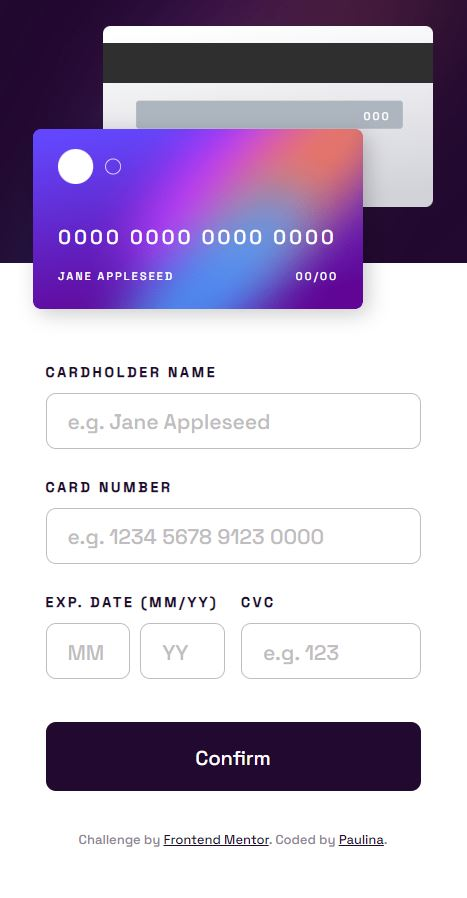
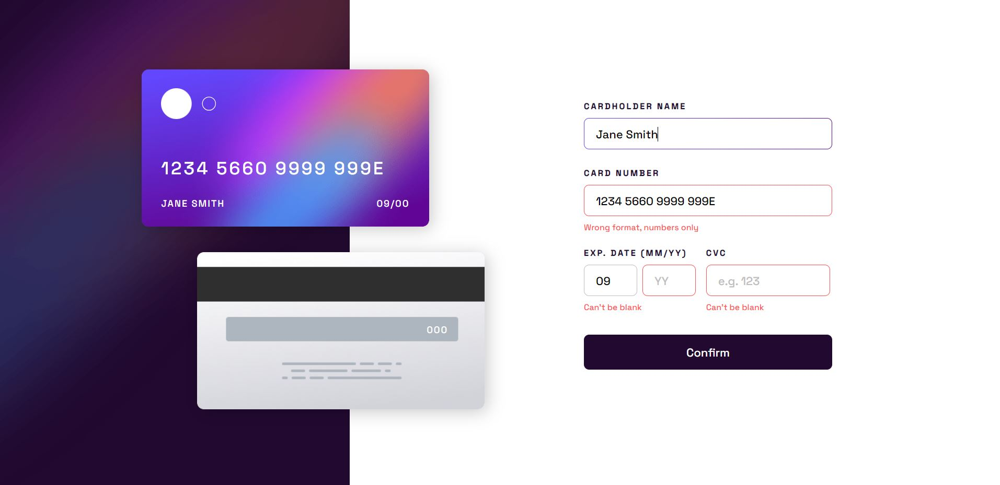

# Frontend Mentor - Interactive card details form solution

This is a solution to the [Interactive card details form challenge on Frontend Mentor](https://www.frontendmentor.io/challenges/interactive-card-details-form-XpS8cKZDWw). Frontend Mentor challenges help you improve your coding skills by building realistic projects. 

## Table of contents

- [Overview](#overview)
  - [The challenge](#the-challenge)
  - [Screenshots](#screenshots)
  - [Link](#link)
- [My process](#my-process)
  - [Built with](#built-with)
  - [What I learned](#what-i-learned)

## Overview

The goal of this project was to design and implement a responsive credit card payment form using HTML, CSS, and JavaScript. The form gives real-time visual feedback and adjusts its layout and fonts according to the screen size. An important feature of the form is that it uses client-side validation to verify the data entered by the user.

### The challenge

Users should be able to:

- Fill in the form and see the card details update in real-time
- Receive error messages when the form is submitted if:
  - Any input field is empty
  - The card number, expiry date, or CVC fields are in the wrong format
- View the optimal layout depending on their device's screen size
- See hover, active, and focus states for interactive elements on the page

### Screenshots

### Link

- Live Site URL: (https://interactive-card-details-form-pk.netlify.app/)

## My process

The design was provided by Frontend Mentor. I started by using semantic HTML5 markup to structure the form and the credit card, taking into account accessibility and SEO considerations. Once the structure was in place, I styled these elements with CSS, using grid and flexbox to create the layout.

Next, I made the form responsive by implementing CSS custom properties and media queries to adjust the layout and fonts based on screen size. To add interactivity to the form, I incorporated JavaScript, setting up event listeners to detect user input, updating the visual preview of the credit card, and implementing real-time form validation.

### Built with

- Semantic HTML5 markup
- CSS custom properties
- Flexbox
- CSS Grid
- Mobile-first workflow
- JavaScript

### What I learned

This project provided valuable experience in several key areas. In terms of JavaScript, I developed a deeper understanding of form validation and live visual feedback, particularly how to implement these features in real time. I also learned how to effectively display error messages for incorrect inputs.

When it comes to responsive design, I refined my skills in using CSS grid and flexbox, discovering new ways to create versatile layouts that adapt to different screen sizes. I also gained experience in dynamically adjusting fonts based on screen size using CSS custom properties.

In summary, this project provided a comprehensive practice in creating a responsive, user-friendly form that features real-time validation and feedback.
